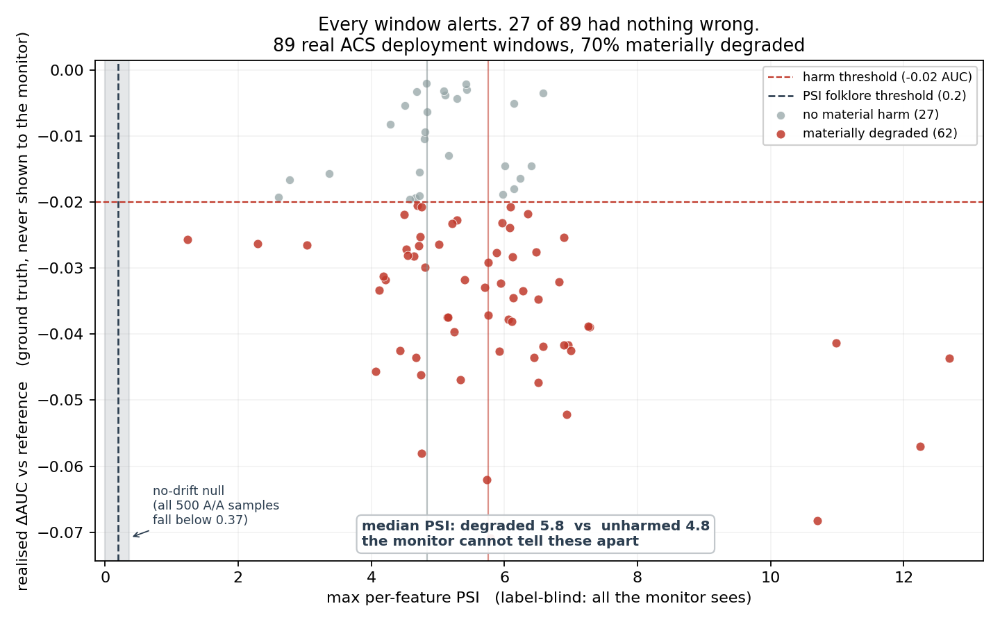

# ModelWatch

**When a drift monitor fires, what is the probability that the model has actually degraded?**

Portfolio drift projects detect drift their own author injected. That measures nothing: the effect size was chosen by the author, so detection is guaranteed and there is no negative class. This project measures the *decision quality of the monitor itself*, against real distribution shift on US Census data, with ground truth the detectors never see.

## Results

- **89 real deployment windows** — one per (state, year) ACS cell, each fixed at 5,000 rows
- **69.7% materially degraded** (95% CI 59.5–78.2%) — the base rate everything divides by
- **70% alert precision** for the standard PSI > 0.2 / p < 0.05 monitor (fires on 100% of windows)
- **100.0% false-alarm rate** on A/A splits where no drift exists by construction
- **0% silent failures** — degraded windows the monitor never flagged
- **CBPE mean absolute error 0.015 AUC** estimating performance with no labels at all



Each point is a real deployment. The monitor sees only the x axis. **27 windows fired with nothing wrong**; **0 degraded windows never fired at all.**

## Why the standard monitor cannot work here

Two independent failures, both measured rather than argued.

**1. The folklore threshold is below the noise floor.** On A/A splits drawn from a single cell — no drift, by construction — the median max-PSI is **0.292**, already above the `PSI > 0.2` rule of thumb. It fires on **100%** of samples where nothing happened. PSI scales with sample size and bin count; 0.2 is a credit-scoring heuristic, not a constant.

**2. Calibrating the threshold does not rescue it.** Real drift is far above the null: the *smallest* max-PSI across 89 windows is **1.24** against a no-drift 99th percentile of **0.345** — **0 of 89** windows fall below it. Every threshold that admits any real window admits all of them.

The reason is visible in one comparison: max-PSI is **5.76** on windows where the model materially degraded and **4.84** where it did not. **Drift is ubiquitous; harm is not.** A detector that measures how much the inputs moved is answering a different question from the one the pager is asking.

## Detector leaderboard

Scored as binary classifiers against realised degradation. **A detector that fires at random scores PR-AUC = the base rate = 0.697**, so that is the line to beat, not 0.5. PR-AUC rather than ROC-AUC because the question is what an alert is worth, not how well the statistic ranks overall.

| detector | PR-AUC | lift over base rate | Spearman vs ΔAUC | p |
|---|---|---|---|---|
| `cbpe_predicted_drop` | 0.975 | +0.278 | -0.829 | 1.3e-23 |
| `psi_mean` | 0.840 | +0.143 | -0.386 | 1.9e-04 |
| `domain_auc` | 0.835 | +0.139 | -0.334 | 1.4e-03 |
| `psi_max` | 0.826 | +0.130 | -0.326 | 1.8e-03 |
| `psi_max_categorical` | 0.826 | +0.130 | -0.326 | 1.8e-03 |
| `ks_max_d` | 0.769 | +0.072 | -0.150 *(n.s.)* | 1.6e-01 |
| `psi_max_numeric` | 0.735 | +0.039 | -0.082 *(n.s.)* | 4.4e-01 |
| `score_psi` | 0.699 | +0.003 | -0.161 *(n.s.)* | 1.3e-01 |
| `neglog_min_p` | 0.693 | -0.003 | -0.025 *(n.s.)* | 8.2e-01 |

Only `cbpe_predicted_drop` clears the base rate by a wide margin. Several marginal detectors show no statistically significant rank correlation with realised degradation at all — marked *(n.s.)*. Note also that `psi_max` and `psi_max_categorical` are identical to three decimals: max-PSI is entirely determined by the high-cardinality categorical columns (OCCP, POBP), and the numeric-only variant is not significant.

## Alerting policies

| policy | precision | recall | alerts/window | silent failures |
|---|---|---|---|---|
| `v0_naive` | 70% | 100% | 100% | 0% |
| `bh_corrected` | 70% | 100% | 100% | 0% |
| `calibrated_psi` | 70% | 100% | 100% | 0% |

## What this project does not claim

- No detection-delay-in-days or alerts-per-week figures. ACS is annual and cross-sectional; there is no day-level clock, so any such number would be fabricated. See `PREREGISTRATION.md`.
- No seasonality analysis, for the same reason.
- No compliance sign-off. `MODEL_CARD.md` is an *input* to a model risk review, not the outcome of one. Nobody has approved anything.
- Synthetic drift appears only in `tests/test_detectors.py`, as a power-curve fixture verifying the detector code responds to shift. It is never a headline result.

## Reproducing

```bash
make data       # download ACS cells (slow, network)
make reproduce  # everything else, fixed seeds
```

Model pinned at SHA-256 `9d2e38bda39b17f1…`, seed 20260914.

See `PREREGISTRATION.md` for the experimental contract, committed before any results existed, and `DEAD_ENDS.md` for what was rejected and why.
